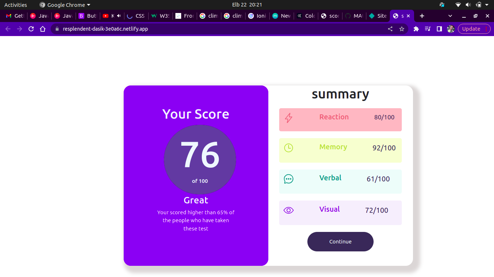

# Authors Name
## Maureen Akinyi Ougo
# Project's Name:
## ScoreBoard  Website 
# Project Description:
### My first scoreBoardPage  project building the interface.
# Project  set-up Instruction:
* Git
* Web Browser
* GitHub
# Technology Used:
* HTML.
* Css.
* Boostrap5
# Bugs
## No unknown bugs for now.
# Livelink
*  Live link to view the project <a href="https://resplendent-dasik-3e0a6c.netlify.app/">Score Board</a>
# Screenshots:

 MIT License

Copyright (c) [2023] [Mauree Akinyi Ougo]

Permission is hereby granted, free of charge, to any person obtaining a copy
of this software and associated documentation files (the "Software"), to deal
in the Software without restriction, including without limitation the rights
to use, copy, modify, merge, publish, distribute, sublicense, and/or sell
copies of the Software, and to permit persons to whom the Software is
furnished to do so, subject to the following conditions:

The above copyright notice and this permission notice shall be included in all
copies or substantial portions of the Software.